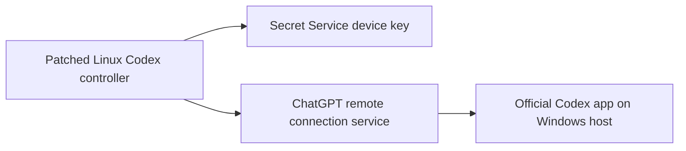

# Codex Linux Remote Controller Patch

[](https://github.com/gshantanu15/codex-linux-remote-controller/actions/workflows/test.yml)

Experimental, unofficial tooling that enables the already-bundled **Control other devices** flow in the Linux Codex desktop app.

> [!WARNING]
> This project modifies installed application files and replaces a TPM-backed component with a lower-assurance Linux Secret Service implementation. It is not supported by OpenAI. Read [Security](SECURITY.md) before installing it, keep a rollback copy, and expect to reapply the patch after Codex updates.

OpenAI's published Remote Connections documentation currently describes controller support on macOS and Windows, not Linux. This project investigates the Linux package and provides a reproducible opt-in patch rather than pretending Linux is officially supported: [OpenAI Remote Connections](https://learn.chatgpt.com/docs/remote-connections).

## What it does

The installed Linux package already contains the controller interface and enrollment client. Two changes make that path usable:

1. Enable the renderer's existing `showControlOtherDevices` gate without changing the packed asset's length.
2. Replace the Linux TPM-only device-key addon with a source-built provider that uses the desktop Secret Service.

It does **not** bypass ChatGPT authentication, account checks, approval prompts, host permissions, or the remote connection relay.



The patch is needed only on the Linux controller in the tested setup. The Windows computer continues to use the official Codex app and its normal **Control this PC** setup.

## Tested result

On 2026-09-28, version `26.924.22138` was tested on an Intel MacBook Air with an Apple T2 chip running a T2-enabled Ubuntu kernel. The Linux controller completed enrollment and connected to an official Windows Codex host.

This is a tested configuration, not a compatibility guarantee. The patch currently targets Linux x86-64 and arm64 builds, while the live end-to-end test was x86-64 only.

Version `0.3.1` recognizes the reviewed binding in Codex `26.1002.51308`, where the feature-flag function was renamed from `he` to `ne`. Inspection, regression tests, and isolated-copy integrity and addon-export verification pass on Linux x86-64. Live enrollment and reconnection on that version remain pending. See [Renderer gate patch](docs/04-ui-gate-patch.md).

## Choose an installation mode

### Isolated test copy — recommended

This copies the application into user-owned storage and gives it a separate Chromium profile, Codex home, SQLite home, and logs:

```bash
npm test
npm run inspect
npm run install
npm run verify
npm run launch
```

Sign in to the isolated copy, open **Settings → Connections → Control other devices**, and complete authorization. Do not copy the official Codex profile into the test profile.

Remove the test app while retaining its profile:

```bash
npm run remove
```

Remove both the test app and its isolated profile:

```bash
npm run remove -- --profile
```

### Official installation — advanced

Close every Codex process first. This workflow creates versioned backups, stages all changes without privileges, and asks for administrator authorization only for the final atomic replacements:

```bash
npm run official:install
npm run official:verify
```

Review and protect the checkout before approving `pkexec`. Node loads the helper and its imported modules from this user-owned working tree, so granting authorization trusts the reviewed project code with root privileges; the helper's path and hash checks are defense in depth, not a sandbox for a hostile checkout.

Restore the exact original files recorded for the currently patched version:

```bash
npm run official:restore
```

Reinstalling the official package is the clean fallback if local rollback is unavailable.

## Requirements

- Linux x86-64 or arm64 with Codex installed at `/usr/lib/chatgpt`.
- Node.js 18 or newer.
- OpenSSL 3.
- A working session D-Bus and Secret Service implementation, tested with GNOME Keyring.
- Native build tools and development headers.

On Ubuntu or Debian:

```bash
sudo apt install build-essential libnode-dev libssl-dev libsecret-1-dev pkg-config
```

## Why the T2 chip did not satisfy the app

The tested Linux system exposed neither `/dev/tpm0` nor `/dev/tpmrm0`. Apple documents the T2 as an SoC containing a Secure Enclave and Secure Key Store, not as a standard TPM 2.0 device. The bundled Linux addon expected a usable TPM interface and rejected enrollment before web authorization completed.

This project does not emulate a TPM, claim T2 attestation, or port Apple's Secure Enclave stack. Instead, it implements the app's observed `allow_os_protected_nonextractable` fallback contract with Secret Service. See [Linux and T2 background](docs/02-linux-and-t2-background.md).

## Security summary

- Private P-256 key material stays out of JavaScript and is stored as a Secret Service item.
- Public metadata is stored with owner-only directory and file permissions.
- The provider exposes create, lookup, sign, and delete operations—no export operation.
- The patch verifies unique bundle markers, ASAR integrity, source hashes, staged hashes, and rollback hashes.
- Missing, changed, or ambiguous required markers cause refusal. There is no reviewed-version allowlist; an unfamiliar release can pass structural checks and still require manual review and a live smoke test.

Secret Service is **not equivalent** to a TPM, Secure Enclave, or genuinely non-exportable PKCS#11 key. A malicious process running as the logged-in user, or root, may be able to retrieve the stored secret. The protocol label describes the addon's API behavior, not a hardware guarantee.

## Updates

Package updates are expected to replace both modified files. Profile state, public-key metadata, and the Secret Service item live outside `/usr/lib/chatgpt` and should remain, but compatibility must be checked again:

```bash
npm run official:verify
npm test
npm run official:install
```

Complete one enrollment or reconnection smoke test after every newly accepted Codex version. Unattended auto-patching is intentionally not provided.

## Documentation

- [Original problem](docs/01-original-problem.md)
- [Linux, TPM, and Apple T2 background](docs/02-linux-and-t2-background.md)
- [Discovery and analysis](docs/03-discovery-and-analysis.md)
- [Renderer gate patch](docs/04-ui-gate-patch.md)
- [Secret Service device-key provider](docs/05-device-key-provider.md)
- [Installation guide](docs/06-installation.md)
- [Updates and rollback](docs/07-updates-and-rollback.md)
- [Troubleshooting](docs/08-troubleshooting.md)
- [Security model](docs/09-security-model.md)
- [Architecture](docs/architecture.md)
- [References](docs/references.md)
- [Implementation record](IMPLEMENTATION.md)
- [Contributing](CONTRIBUTING.md)

## Project origin

The investigation started from [openai/codex issue #28919](https://github.com/openai/codex/issues/28919) and its [linked implementation discussion](https://github.com/openai/codex/issues/28919#issuecomment-5600027691). The code here is an independent Linux experiment based on inspection of a locally installed package and end-to-end testing.

## Publication boundary

This repository contains source code and documentation only. Do not publish OpenAI binaries, `app.asar`, native binaries, credentials, cookies, keyring contents, account identifiers, logs containing tokens, or desktop profile data.

## License

Licensed under the [Apache License 2.0](LICENSE).
