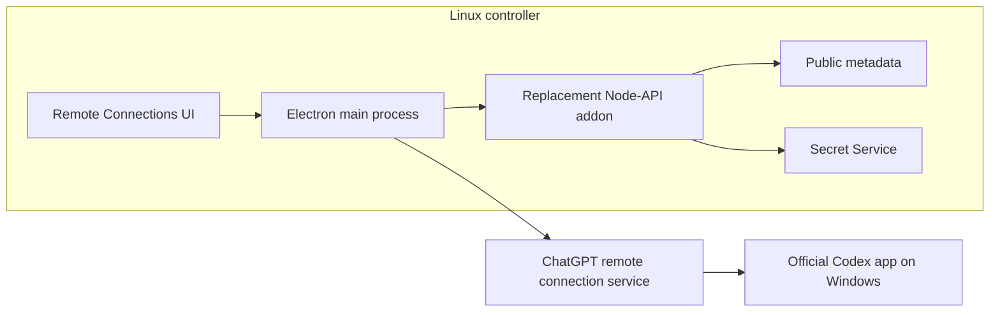
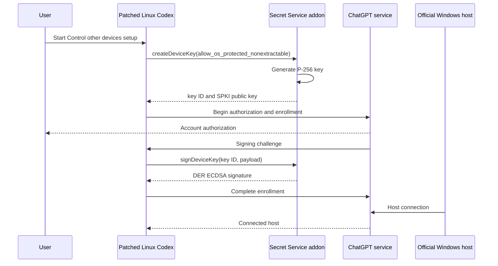
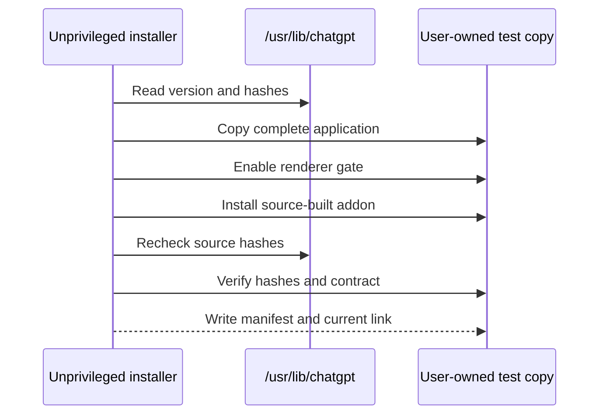
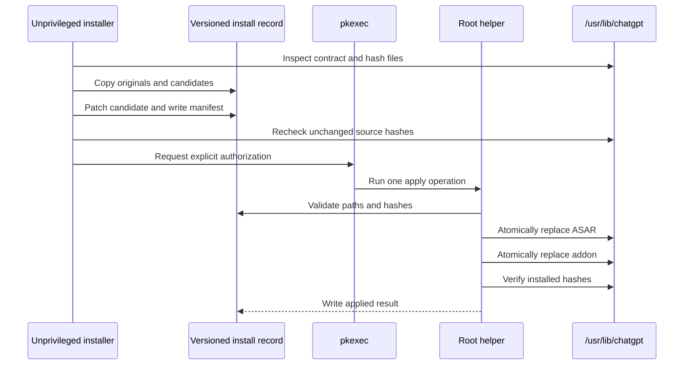

# Architecture

## Components

### Renderer patcher

Reads `app.asar`, finds one known remote-connections asset, enables its existing visibility gate, updates packed-file integrity metadata, and verifies the result.

### Contract inspector

Finds the main bundle that loads `remote-control-device-key.node` and verifies the markers used by the observed JavaScript client.

### Native provider

Implements the minimal four-method asynchronous Node-API surface and performs P-256 key generation and signing with OpenSSL.

### Secret Service

Stores the serialized private key in the logged-in user's desktop keyring. It is a shared desktop service, even when the app profile is isolated.

### Public metadata store

Stores only key identifier, protection class, algorithm, and public-key data under `$CODEX_HOME` with owner-only permissions.

### Test-copy installer and launcher

Copies the complete app into user storage, applies both changes, records hashes, verifies the staged application, and launches it with isolated profile paths.

### Official installer and root helper

Stages and validates without privileges. A purpose-limited helper performs the validated official-file replacements or restoration after explicit `pkexec` authorization. Because Node loads it from the user-owned checkout, authorization trusts the reviewed checkout as root; helper checks are defense in depth rather than isolation from malicious project code.

## Enrollment sequence

The exact service payloads are internal and intentionally not reimplemented by this project.

## Test-copy installation sequence

## Official installation sequence

## State locations

| State | Location | Contains proprietary binary |
| --- | --- | --- |
| Project source | Git working tree | No |
| Native build output | `build/` | No, but generated and ignored |
| Test application | `~/.local/share/codex-linux-remote-controller-test/versions/` | Yes |
| Isolated profiles | `~/.local/share/codex-linux-remote-controller-test/profiles/` | User data |
| Official rollback records | `~/.local/share/codex-linux-remote-controller-test/official-installs/` | Yes |
| Public key metadata | `$CODEX_HOME/device-keys-os-protected-v1/` | No private key |
| Private key | Desktop Secret Service | Yes |

Only the project source belongs in Git.
